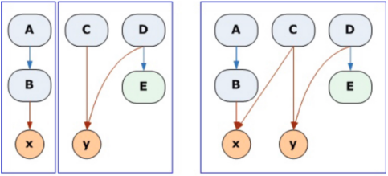

# Class Cohesion

A class had maximum cohesion when every class field is used in every method. It has the minimum cohesion when each class field is only used by a single method. Of course, most classes fall in between.

Imagine if you create a graph for your class where each method and field is a node. You then draw a line from each method to the fields or other methods that it uses. If you end up with a fully connected graph, you have a cohesive class. But if you end up with isolated islands, you have an incohesive class.

As a rule of thumb, high cohesion is good, as it means that the methods and fields of the class are co-dependent and belong together as a logical whole (right side).

But when cohesion is low, and you have unconnected islands, it’s as if you are forcing two separate logical units together (left side). It’s as if another class is trying to get out of the larger class. You should try to separate the fields and methods into two classes, so that the new classes are more cohesive.

### Breaking large methods via Cohesion

Imagine the following scenario:

- You have a large method with many variables and lots of code.
- You want to extract one small part of that method into a separate method.
- The code fragment that you want to extract uses four of the variables declared in the big method.
- You first think to pass the four variables into the new function as arguments.
- You then remember the rule that methods should not have too many arguments.
- Instead, you promote those four variables to class fields, to make them accessible to the new method and end up with no arguments to pass.

If the class had no other methods, everything would be fine. But imagine that the class already had other methods that have nothing to do with the new class fields that you have created. This means that you have reduced the cohesion of the class.

But wait! If there are a few functions that want to share certain fields, doesn’t that make them a class in their own right? Of course it does. When classes lose cohesion, split them!

Breaking a large method into many smaller ones often gives us the opportunity to split several smaller classes out as well. This gives your program a much better organization and a more transparent structure.
